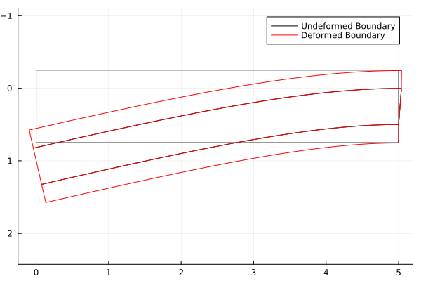
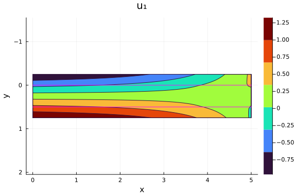
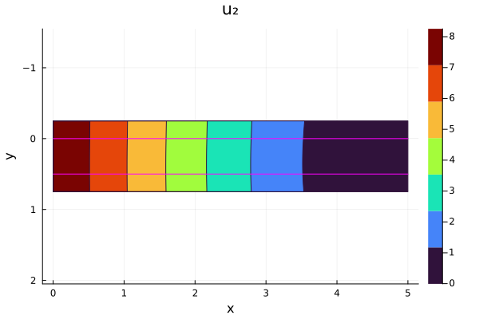
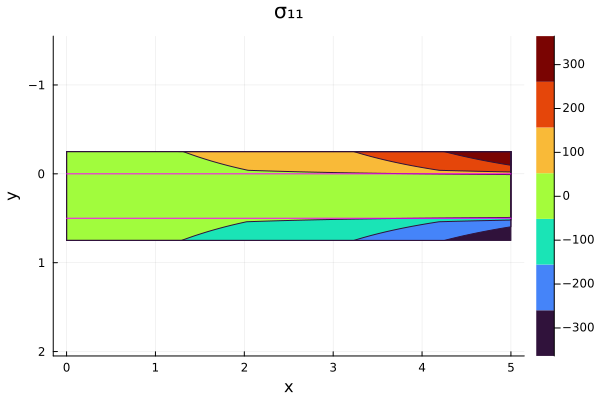
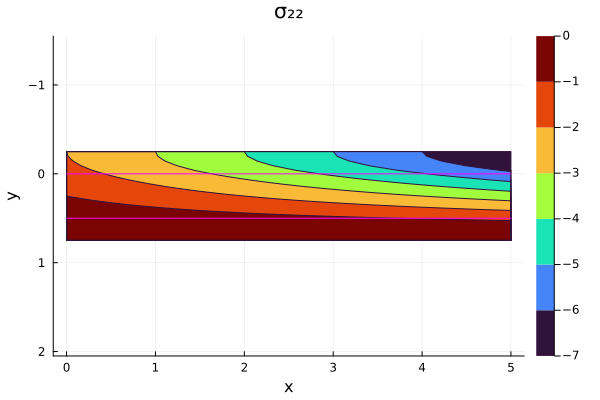

# Two-Dimensional Three-Layer Cantilever Sandwich Beam Solution

This repository provides the code implementation of an analytical solution for a three-layer cantilever sandwich beam in two dimensions. The same implementation is made in FORTRAN and Julia languages; for Greek and Trojans, feel free to use whatever you want.

## Features

- **Dual Implementation**: Implemented both in Julia and FORTRAN.
- **Verify Numerical Implementations**: This can also be used to validate and verify Finite Element Method (FEM) implementations or other numerical methods.
- **Parametric Studies**: This enables the exploration of different material properties, layer heights, beam sizes, and loading conditions.
- **Examples**: The FORTRAN version provides a simple example that performs calculations for a single point in the geometric center of the beam, which is also shown in Julia, respectively, `example.f90` and `Example.jl`. However, the Julia version goes further by including `ExampleWithPlots.jl`, that computes values for a set of points, enabling the visualization of displacements, deformation, stress, and strain (see pictures).

## Pictures

 
 
 


## Usage

### FORTRAN

To use the FORTRAN version, if you are comfortable with Makefiles and GNU gfortran, run `make` to generate the binary example from `example.f90`, which is linked with `sandwich_solution.f90`. This file can be detached and integrated into other software or libraries (see LICENSE for details).

```bash
git clone https://github.com/rodrgz/2D3LayerCantileverBeam
cd 2D3LayerCantileverBeam/fortran
make
./example
```

### Julia

To run the example in Julia, execute the following commands:

```bash
git clone https://github.com/rodrgz/2D3LayerCantileverBeam
cd 2D3LayerCantileverBeam/julia
julia ExampleWithPlots.jl # or Example.jl which is equal to example.f90
```

`ExampleWithPlots.jl` uses the Plots.jl library, so ensure you have this library installed on your system before running the example. Additionally, you can incorporate `SandwichSolution.jl` into your Julia code (see LICENSE for details).

## How to cite 2D3LayerCantileverBeam

In order to give credit to the `2D3LayerCantileverBeam` contributors, we simply ask you to cite the reference below in any publication in which you have made use of the `2D3LayerCantileverBeam` library.

```
@article{DaRosaRodriguez_Rossi_2024,
  doi = {##},
  url = {https://doi.org/##/##},
  year = {2024},
  publisher = {##},
  volume = {##},
  number = {##},
  pages = {##},
  author = {Erik da Rosa Rodriguez and Rodrigo Rossi},
  title = {2D Analytical Solution and XFEM Verification of a Three-Layer Sandwich Beam Under Various Loads},
  journal = {To appear in ...}
}
```

## Licensing

We are not your lawyers, but here is a simple explanation of the intention behind the license.

The `2D3LayerCantileverBeam` library is available under the terms of the Mozilla Public License (MPL). You can freely link to the library with software distributed under any license, but if you modify the library, you must release your derivative works under the MPL as well. See the LICENSE file for details.

## Contact

Please, contact me, [Erik Rodriguez](mailto:erik@rodgz.com) for further questions about licenses and terms of use.
